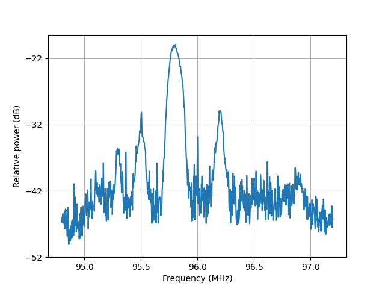
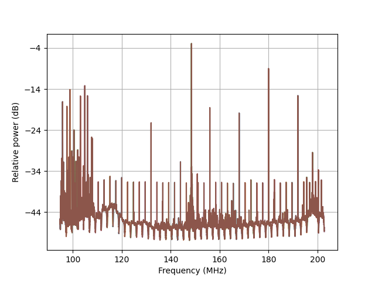
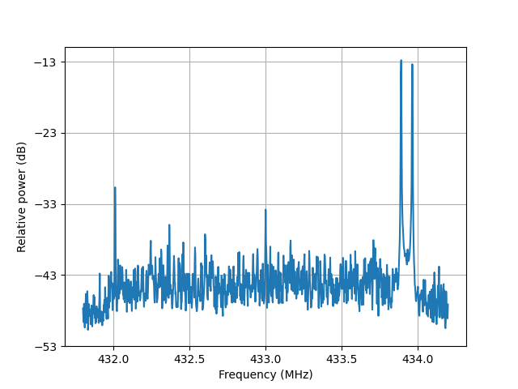

# Reporte
Proyecto para detectar interferencias en una banda concreta de frecuencias.

**Hecho hasta ahora**
> 
> - [x] Puesta a punto de la raspberry Pi 4B (8GB) con el sistema operativo raspbian.
> - [x] Instalación de todas las bibliotecas necesarias para el funcionamiento de `pyrtlsdr`, la biblioteca empleada para capturar las señales en la banda deseada.
> - [x] Test de funcionamiento de la biblioteca para analizar el espectro radioeléctrico.
>   * Test básico de medición en una banda de frecuencia:
>   
>   * Test barrido en frecuencia desde 96 a 200 MHz. Problemática: Aparecen *spikes* en cada una de las frecuencias centrales de cada medición. No debería ser un problema, no vamos a realizar barridos en frecuencia.
>   
>   * Medición de frecuencia en la banda del mando de un coche:
>   
>
Se han encontrado ciertos problemas al probar las librerías y el dispositivo:
- El **ancho de banda es muy limitado**, de unos *2 MHz*. No debería suponer un problema para la mayoría de aplicaciones *LoRa*, pero para otras sí podría serlo.
- Encontramos **picos**(*spikes*) en algunas de las mediciones, sobre todo cuando las realizamos muy rápido.
- El dispositivo `rtlsdr` no realiza un consumo mínimo de energía, hasta cuando está en *standby*. Esto tendrá implicaciones en la autonomía de la raspberry-pi si la alimentamos con una batería. 

Se ha realizado una investigación sobre lo que podría ser interesante para implementar en este proyecto:
*  **Software de monitorización continua de una banda de frecuencia**: Midiendo el nivel de energía de base en la banda medida y realizando la diferencia de energía en la banda entre el umbral y la actual podemos detectar una intrusión.
* **Encapsulado** de estos **datos** en un protocolo como ***MQTT*** para enviarlos a un servidor central y monitorizarlos. 
* **Reportar** las intrusiones mediante MQTT o email.

A continuación definimos los **objetivos** del proyecto para la próxima semana:
> - [ ] Buscar otros métodos de detección de intrusión.
> - [ ] Investigar sobre el encapsulamiento de MQTT: [MQTT guide](http://www.steves-internet-guide.com/mqtt/)
> - [ ] Librerías para Python: [Paho](https://wiki.eclipse.org/Paho)

